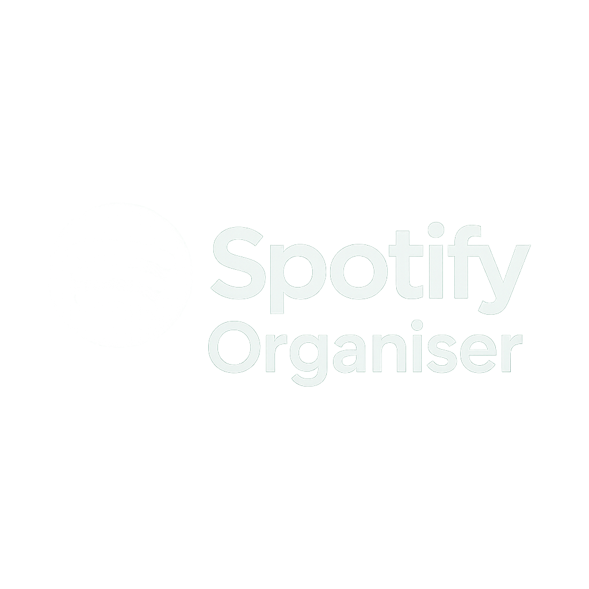

## 🎵 Spotify Organiser

**Spotify Organiser** is a Streamlit web app that connects to your Spotify account and automatically organizes your playlists into new genre-based playlists using the Spotify Web API and Spotipy.



---

### 🚀 Features

* ✅ Connect securely to your Spotify account
* ✅ Fetch and list your playlists
* ✅ Detect genres based on artist metadata
* ✅ Group tracks by genre
* ✅ Automatically create new playlists by genre
* ✅ Built with Python, Streamlit, and Spotipy

---

### 🛠️ Setup Instructions

#### 1. Clone the Repo

```bash
git clone https://github.com/KshKnsl/spotify-organiser.git
cd spotify-organiser
```

#### 2. Set Up Virtual Environment

Using [`uv`](https://github.com/astral-sh/uv):

```bash
uv venv
uv pip install .
```

#### 3. Set Up Spotify Developer App

* Go to [Spotify Developer Dashboard](https://developer.spotify.com/dashboard/)
* Create an app
* Get your **Client ID**, **Client Secret**, and set **Redirect URI** to:

  ```
  http://localhost:8888/callback
  ```

#### 4. Create `.env` File

```env
SPOTIPY_CLIENT_ID=your_client_id
SPOTIPY_CLIENT_SECRET=your_client_secret
SPOTIPY_REDIRECT_URI=http://localhost:8888/callback
```

#### 5. Run the App

```bash
streamlit run streamlit_app.py
```

---

### 🧠 Future Improvements

* Add clustering using audio features
* Allow sorting by mood or tempo
* Add bulk processing of multiple playlists
* Visualize audio stats (danceability, energy, etc.)

---

### 💡 Built With

* [Spotipy](https://spotipy.readthedocs.io/)
* [Streamlit](https://streamlit.io/)
* [Python](https://www.python.org/)
* [Spotify Web API](https://developer.spotify.com/documentation/web-api/)

---

### 📄 License

MIT License — see `LICENSE` file.

---